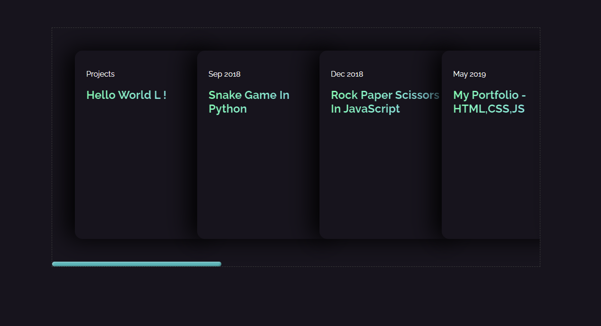
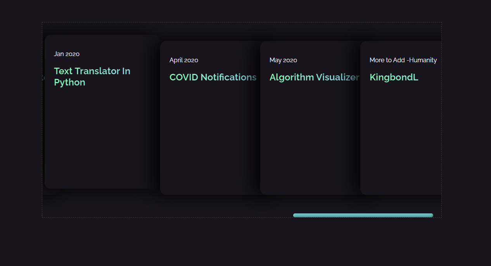
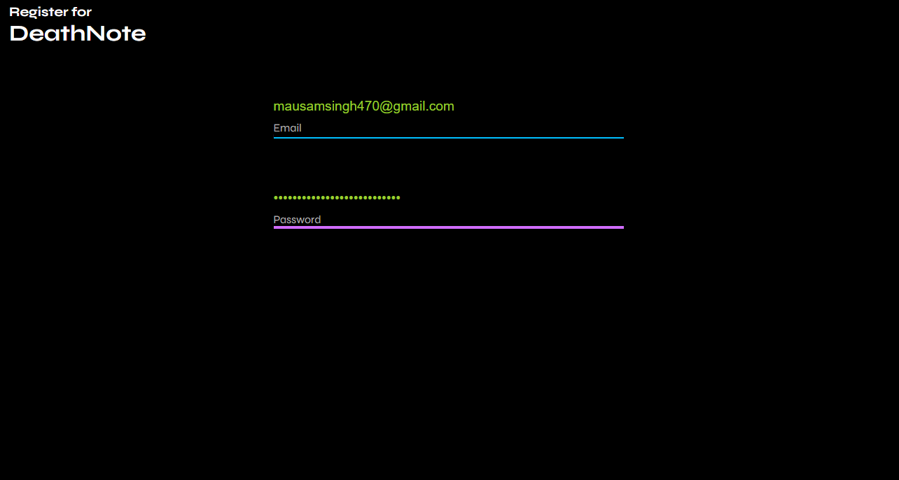
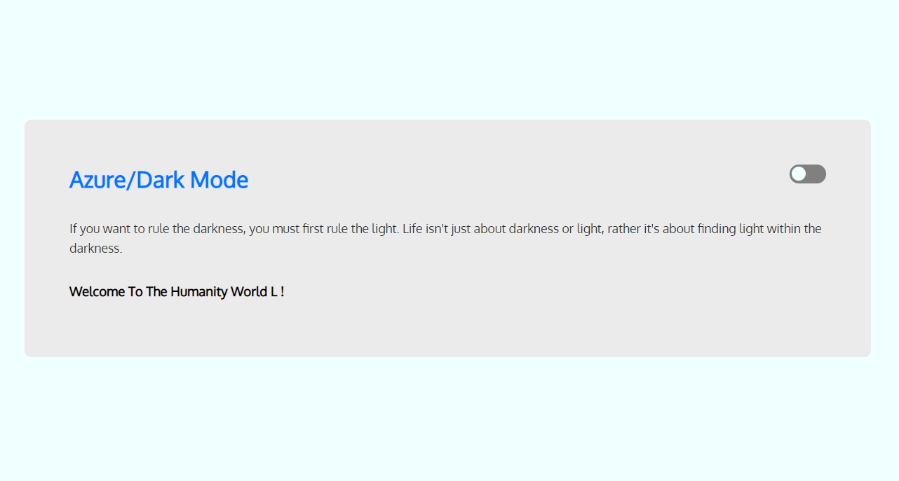
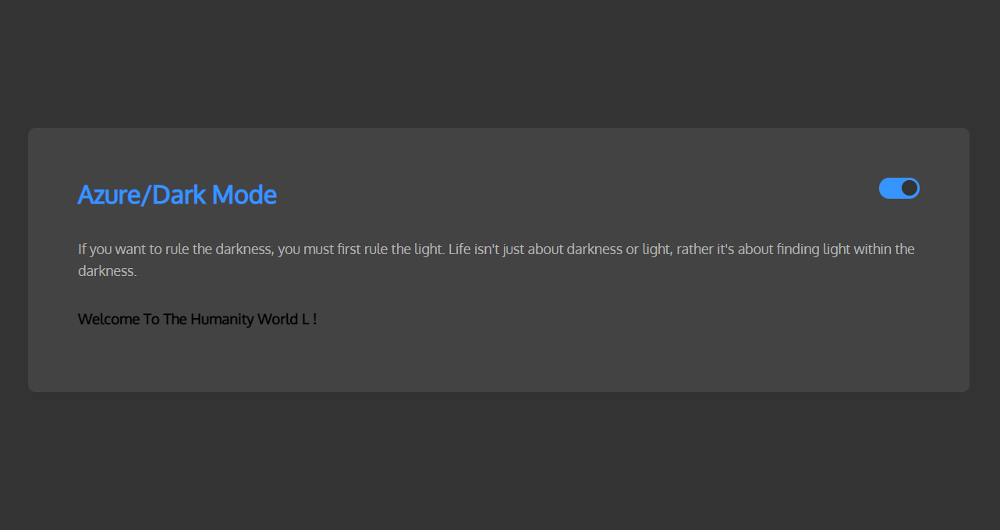
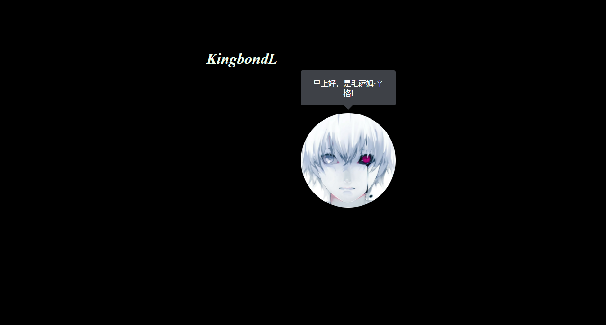

# CSS-PROJECT 👨‍💻
It will contain the wonderful CSS Page. I'm learning css from long time !

Card Hover - Stack 🌻 

EMOJI 🌻 CSS ANIMATION 🚀

Login Form 

Dark Mode Change 

Profile Text Hover

